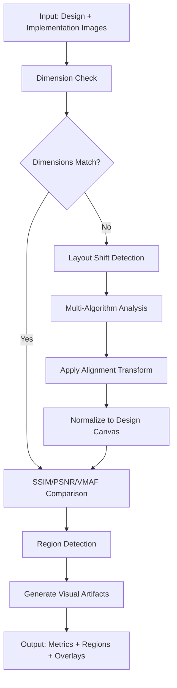

# UI Diff MCP Server

A Model Context Protocol (MCP) server for comparing UI designs vs implementations using advanced image metrics (SSIM, PSNR, VMAF).

Based on the [DeltaVision investigation document](docs/deltavision-ssim-psnr-vmaf-investigation.md), this server provides three core tools for automated UI difference detection and analysis.

## Features

- **🎯 Precise Region Detection**: Uses SSIM heatmaps to identify specific UI differences
- **📊 Multiple Metrics**: PSNR, SSIM, and VMAF for comprehensive similarity analysis  
- **🎨 Visual Overlays**: Generate annotated images highlighting difference regions
- **⚡ Fast Processing**: FFmpeg-based implementation for performance
- **🔧 Flexible**: Configurable thresholds and minimum area filters

## Workflow

The UI Diff MCP Server provides an intelligent workflow for comparing design mockups against implementation screenshots:

### 🔄 **Core Workflow: Alignment + Comparison**



### 🎯 **Alignment-First Philosophy**

1. **Dimension Analysis**: Check if images have matching dimensions
2. **Layout Shift Detection**: Use 3 algorithms for robust shift detection:
   - **Phase Correlation**: Fast frequency-domain translation detection
   - **ECC Registration**: Enhanced correlation coefficient for affine transforms  
   - **Feature Matching**: SIFT/ORB features for complex transformations
3. **Smart Alignment**: Apply inverse transformation to align implementation to design space
4. **Accurate Comparison**: Compute metrics on properly aligned images

### 🧮 **Multi-Algorithm Confidence**

The system automatically selects the best alignment method based on confidence scores:
- **High Confidence (>90%)**: Precise alignment with sub-pixel accuracy
- **Medium Confidence (40-90%)**: Reliable alignment with minor adjustments  
- **Low Confidence (<40%)**: Fallback to simpler methods or manual review

## Tools

### `compute_diff_with_alignment`

**Primary tool** - Complete workflow with automatic alignment and comparison.

**Input:**
```typescript
{
  target_path: string,              // Design/reference image path
  current_path: string,             // Implementation image path
  alignment_method?: string,        // "auto", "phase_correlation", "ecc", "feature_matching"
  preserve_design?: boolean,        // Keep design unchanged (default: true)
  design_is_target?: boolean,       // Target is design reference (default: true)
  threshold?: number,               // Pixelmatch threshold (default: 0.1)
  min_region_area?: number         // Min region area in pixels (default: 64)
}
```

**Output:**
```json
{
  "canvas": {"w": 1616, "h": 310},
  "alignment": {
    "shift_detection": {
      "primary_result": {
        "dx": -6.0, "dy": -24.0, "confidence": 0.996, 
        "scale": 1.002, "rotation_deg": 0.002, "method": "ecc_registration"
      },
      "recommendation": {"action": "minor_alignment", "reason": "Minor shift detected"}
    },
    "preprocessing_applied": true,
    "design_preserved": true
  },
  "pixelmatch": {"total_pixels": 500960, "diff_pixels": 0, "percentage": 0},
  "ffmpeg_metrics": {"ssim_avg": 1.0, "psnr": 100, "vmaf": 1.000002},
  "artifacts": {
    "aligned_implementation_path": "aligned_implementation_*.png",
    "pixelmatch_diff_path": "pixelmatch_diff_*.png", 
    "overlay_path": "overlay_*.png"
  },
  "regions": []
}
```

### `compute_diff_regions`

Legacy tool - Direct region comparison without alignment.

**Input:**
```typescript
{
  target_path: string,     // Path to design/reference image
  current_path: string,    // Path to implementation image  
  threshold?: number,      // Min difference threshold (0-1, default: 0.0)
  min_area_px?: number    // Min region area in pixels (default: 64)
}
```

### `score_global`

Direct similarity scoring without alignment.

**Input:**
```typescript
{
  target_path: string,
  current_path: string
}
```

### `render_overlay`

Generate visual overlay from existing regions.

**Input:**
```typescript
{
  current_path: string,
  regions: Region[]  // From compute_diff_regions output
}
```

## Installation

### Prerequisites

Before installing, ensure you have the required dependencies:

- **Node.js** 18+ 
- **FFmpeg** with libvmaf support (required for VMAF metrics)

#### Installing FFmpeg

```bash
# macOS (with Homebrew)
brew install ffmpeg

# Ubuntu/Debian
sudo apt-get update
sudo apt-get install ffmpeg

# Windows (with Chocolatey)
choco install ffmpeg

# Verify FFmpeg installation
ffmpeg -version
```

### Install UI Diff MCP

#### Option 1: From Source (Recommended)

```bash
# Clone the repository
git clone <repository-url>
cd ui-diff-mcp

# Install dependencies
npm install

# Build the project
npm run build

# Optional: Run tests to verify installation
npm test
```

#### Option 2: Install from NPM (when published)

```bash
npm install -g ui-diff-mcp
```

## Usage

### As MCP Server

#### Claude Desktop Configuration

Add the server to your Claude Desktop configuration file:

**Location:** 
- **macOS**: `~/Library/Application Support/Claude/claude_desktop_config.json`
- **Windows**: `%APPDATA%/Claude/claude_desktop_config.json`

```json
{
  "mcpServers": {
    "ui-diff": {
      "command": "node",
      "args": ["/absolute/path/to/ui-diff-mcp/dist/index.js"],
      "env": {}
    }
  }
}
```

#### Other MCP Clients

For other MCP-compatible clients, use the provided configuration example:

```bash
# Copy the example configuration
cp mcp-config-example.json your-mcp-config.json

# Edit the file to match your setup
# Update the path in args to point to your installation
```

#### Quick Start

After installation and configuration:

1. **Restart Claude Desktop** to load the new MCP server
2. **Verify installation** by asking Claude: "List available MCP tools"
3. **Test with sample images**:
   ```
   Compare design.png and implementation.png using compute_diff_with_alignment
   ```

### MCP Tool Usage Examples

Once configured as an MCP server, you can use these tools through your MCP client:

#### Basic Comparison
```
Use compute_diff_with_alignment to compare:
- target_path: "./design.png" 
- current_path: "./implementation.png"
```

#### Advanced Comparison with Custom Settings
```
Use compute_diff_with_alignment to compare images with:
- target_path: "./design.png"
- current_path: "./implementation.png"  
- alignment_method: "phase_correlation"
- threshold: 0.05
- min_region_area: 100
```

#### Legacy Region Detection
```
Use compute_diff_regions to find differences between:
- target_path: "./design.png"
- current_path: "./implementation.png"
- threshold: 0.1
```

### Direct Usage (Programmatic)

If using as a Node.js library:

```typescript
import { computeDiffRegions, scoreGlobal, renderOverlay } from 'ui-diff-mcp';

// Analyze differences with alignment
const result = await computeDiffWithAlignment({
  target_path: './design.png',
  current_path: './implementation.png',
  alignment_method: 'auto',
  threshold: 0.1,
  min_region_area: 100
});

// Get global similarity scores
const scores = await scoreGlobal({
  target_path: './design.png', 
  current_path: './implementation.png'
});

// Create visual overlay
const overlayPath = await renderOverlay({
  current_path: './implementation.png',
  regions: result.regions
});
```

## Testing

```bash
# Run all tests
npm test

# Watch mode for development
npm run test:watch

# Clean test artifacts
npm run test:clean

# Run build and test together
npm run build && npm test
```

## Troubleshooting

### Common Issues

#### MCP Server Not Found
- **Issue**: Claude Desktop can't find the UI Diff server
- **Solution**: 
  1. Verify the path in `claude_desktop_config.json` is absolute
  2. Check that `dist/index.js` exists after running `npm run build`
  3. Restart Claude Desktop after configuration changes

#### FFmpeg Not Found
- **Issue**: VMAF metrics fail with "FFmpeg not found"
- **Solution**:
  ```bash
  # Verify FFmpeg is installed and accessible
  which ffmpeg
  ffmpeg -version
  
  # If not installed, install FFmpeg (see Prerequisites)
  ```

#### Permission Errors
- **Issue**: Permission denied when accessing images
- **Solution**: Ensure image files have read permissions:
  ```bash
  chmod +r design.png implementation.png
  ```

#### Module Resolution Errors
- **Issue**: TypeScript/Node.js import errors
- **Solution**:
  ```bash
  # Clean and rebuild
  npm run clean
  npm install
  npm run build
  ```

### Debug Mode

Enable verbose logging by setting environment variables:

```bash
# For MCP server debugging
DEBUG=ui-diff:* node dist/index.js

# For development
npm run dev
```

### Getting Help

1. Check the [issues page](../../issues) for known problems
2. Verify your installation matches the requirements
3. Test with the provided sample images in the test directory
4. Create a minimal reproduction case when reporting bugs

## Development

Built using Test-Driven Development (TDD):

1. **Red Phase**: Tests written first defining expected behavior
2. **Green Phase**: Minimal implementation to pass tests  
3. **Refactor Phase**: Optimization while keeping tests green

### Architecture

```
src/
├── tools/           # Core MCP tools
│   ├── compute-diff-regions.ts
│   ├── score-global.ts
│   └── render-overlay.ts
├── utils/          # Utility functions
│   ├── ffmpeg.ts   # FFmpeg integration
│   └── image-processing.ts
├── types.ts        # TypeScript types & Zod schemas
├── server.ts       # MCP server implementation
└── index.ts        # Main entry point
```

## Based on DeltaVision Research

This implementation follows the patterns and recommendations from the [DeltaVision investigation document](docs/deltavision-ssim-psnr-vmaf-investigation.md), including:

- FFmpeg-based PSNR/VMAF computation
- SSIM heatmap generation for region detection
- Structured JSON responses matching specified schema
- Configurable thresholds and filtering options

## License

MIT