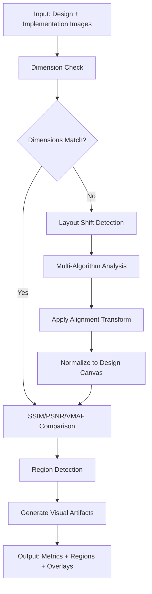

# UI Diff MCP Server

A Model Context Protocol (MCP) server for comparing UI designs vs implementations using advanced image metrics (SSIM, PSNR, VMAF).

Based on the [DeltaVision investigation document](docs/deltavision-ssim-psnr-vmaf-investigation.md), this server provides three core tools for automated UI difference detection and analysis.

## Features

- **🎯 Precise Region Detection**: Uses SSIM heatmaps to identify specific UI differences
- **📊 Multiple Metrics**: PSNR, SSIM, and VMAF for comprehensive similarity analysis  
- **🎨 Visual Overlays**: Generate annotated images highlighting difference regions
- **⚡ Fast Processing**: FFmpeg-based implementation for performance
- **🔧 Flexible**: Configurable thresholds and minimum area filters

## Workflow

The UI Diff MCP Server provides an intelligent workflow for comparing design mockups against implementation screenshots:

### 🔄 **Core Workflow: Alignment + Comparison**



### 🎯 **Alignment-First Philosophy**

1. **Dimension Analysis**: Check if images have matching dimensions
2. **Layout Shift Detection**: Use 3 algorithms for robust shift detection:
   - **Phase Correlation**: Fast frequency-domain translation detection
   - **ECC Registration**: Enhanced correlation coefficient for affine transforms  
   - **Feature Matching**: SIFT/ORB features for complex transformations
3. **Smart Alignment**: Apply inverse transformation to align implementation to design space
4. **Accurate Comparison**: Compute metrics on properly aligned images

### 🧮 **Multi-Algorithm Confidence**

The system automatically selects the best alignment method based on confidence scores:
- **High Confidence (>90%)**: Precise alignment with sub-pixel accuracy
- **Medium Confidence (40-90%)**: Reliable alignment with minor adjustments  
- **Low Confidence (<40%)**: Fallback to simpler methods or manual review

## Tools

### `compute_diff_with_alignment`

**Primary tool** - Complete workflow with automatic alignment and comparison.

**Input:**
```typescript
{
  target_path: string,              // Design/reference image path
  current_path: string,             // Implementation image path
  alignment_method?: string,        // "auto", "phase_correlation", "ecc", "feature_matching"
  preserve_design?: boolean,        // Keep design unchanged (default: true)
  design_is_target?: boolean,       // Target is design reference (default: true)
  threshold?: number,               // Pixelmatch threshold (default: 0.1)
  min_region_area?: number         // Min region area in pixels (default: 64)
}
```

**Output:**
```json
{
  "canvas": {"w": 1616, "h": 310},
  "alignment": {
    "shift_detection": {
      "primary_result": {
        "dx": -6.0, "dy": -24.0, "confidence": 0.996, 
        "scale": 1.002, "rotation_deg": 0.002, "method": "ecc_registration"
      },
      "recommendation": {"action": "minor_alignment", "reason": "Minor shift detected"}
    },
    "preprocessing_applied": true,
    "design_preserved": true
  },
  "pixelmatch": {"total_pixels": 500960, "diff_pixels": 0, "percentage": 0},
  "ffmpeg_metrics": {"ssim_avg": 1.0, "psnr": 100, "vmaf": 1.000002},
  "artifacts": {
    "aligned_implementation_path": "aligned_implementation_*.png",
    "pixelmatch_diff_path": "pixelmatch_diff_*.png", 
    "overlay_path": "overlay_*.png"
  },
  "regions": []
}
```

### `compute_diff_regions`

Legacy tool - Direct region comparison without alignment.

**Input:**
```typescript
{
  target_path: string,     // Path to design/reference image
  current_path: string,    // Path to implementation image  
  threshold?: number,      // Min difference threshold (0-1, default: 0.0)
  min_area_px?: number    // Min region area in pixels (default: 64)
}
```

### `score_global`

Direct similarity scoring without alignment.

**Input:**
```typescript
{
  target_path: string,
  current_path: string
}
```

### `render_overlay`

Generate visual overlay from existing regions.

**Input:**
```typescript
{
  current_path: string,
  regions: Region[]  // From compute_diff_regions output
}
```

## Installation

```bash
npm install
npm run build
```

## Usage

### As MCP Server

Add to your MCP client configuration:

```json
{
  "mcpServers": {
    "ui-diff": {
      "command": "node",
      "args": ["/path/to/ui-diff-mcp/dist/index.js"]
    }
  }
}
```

### Direct Usage

```typescript
import { computeDiffRegions, scoreGlobal, renderOverlay } from 'ui-diff-mcp';

// Analyze differences
const result = await computeDiffRegions({
  target_path: './design.png',
  current_path: './implementation.png',
  threshold: 0.1,
  min_area_px: 100
});

// Get global scores  
const scores = await scoreGlobal({
  target_path: './design.png', 
  current_path: './implementation.png'
});

// Create overlay visualization
const overlayPath = await renderOverlay({
  current_path: './implementation.png',
  regions: result.regions
});
```

## Requirements

- **Node.js** 18+
- **FFmpeg** with libvmaf support (for VMAF metrics)
  ```bash
  # macOS
  brew install ffmpeg
  
  # Linux
  apt-get install ffmpeg
  ```

## Testing

```bash
npm test          # Run all tests
npm run test:watch # Watch mode for development
```

## Development

Built using Test-Driven Development (TDD):

1. **Red Phase**: Tests written first defining expected behavior
2. **Green Phase**: Minimal implementation to pass tests  
3. **Refactor Phase**: Optimization while keeping tests green

### Architecture

```
src/
├── tools/           # Core MCP tools
│   ├── compute-diff-regions.ts
│   ├── score-global.ts
│   └── render-overlay.ts
├── utils/          # Utility functions
│   ├── ffmpeg.ts   # FFmpeg integration
│   └── image-processing.ts
├── types.ts        # TypeScript types & Zod schemas
├── server.ts       # MCP server implementation
└── index.ts        # Main entry point
```

## Based on DeltaVision Research

This implementation follows the patterns and recommendations from the [DeltaVision investigation document](docs/deltavision-ssim-psnr-vmaf-investigation.md), including:

- FFmpeg-based PSNR/VMAF computation
- SSIM heatmap generation for region detection
- Structured JSON responses matching specified schema
- Configurable thresholds and filtering options

## License

MIT