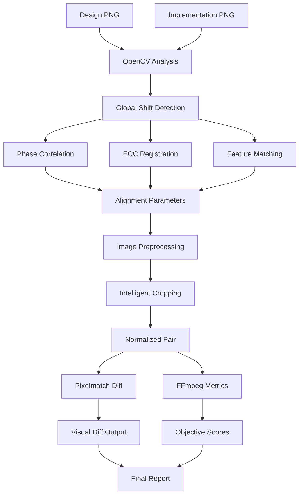

# OpenCV Global Shift Detection + Pixelmatch Comparison Tech Design

_Last updated: 2025-08-25_

## Executive Summary

This document outlines a technical design for enhancing UI comparison by combining:
1. **OpenCV global shift detection** to align images with different dimensions/positions
2. **Intelligent cropping** to extract comparable regions
3. **Pixelmatch comparison** for precise pixel-level diff visualization
4. **FFmpeg metrics** for objective scoring (SSIM, PSNR, VMAF)

This approach addresses the core limitation of current MCP tools that require identical dimensions by preprocessing images to achieve optimal alignment before comparison.

---

## Problem Statement

### Current Limitations
- **MCP UI Diff Tools**: Require identical image dimensions
- **FFmpeg Blend Mode**: Fails when image sizes don't match
- **Design vs Implementation**: Often have different viewport sizes, scroll positions, or layout shifts
- **Pixel-Perfect Comparison**: Doesn't account for minor global translations or scaling differences

### Target Solution
- **Dimension-Agnostic**: Handle images of different sizes
- **Layout-Aware**: Detect and compensate for global shifts
- **Objective Scoring**: Maintain FFmpeg's SSIM/PSNR/VMAF accuracy
- **Visual Feedback**: Generate clear diff visualizations

---

## System Architecture



---

## Technical Components

### 1. OpenCV Global Shift Detection Module

Based on the research in `opencv_layout_shift_research.md`, implement three complementary methods:

#### Phase Correlation (Primary Method)
```python
def detect_global_translation(img_a: np.ndarray, img_b: np.ndarray) -> dict:
    """
    Fast detection of pure translation between images
    Returns: {dx: float, dy: float, confidence: float}
    """
    # Convert to grayscale if needed
    gray_a = cv2.cvtColor(img_a, cv2.COLOR_BGR2GRAY) if len(img_a.shape) == 3 else img_a
    gray_b = cv2.cvtColor(img_b, cv2.COLOR_BGR2GRAY) if len(img_b.shape) == 3 else img_b
    
    # Resize to same dimensions for correlation
    min_height = min(gray_a.shape[0], gray_b.shape[0])
    min_width = min(gray_a.shape[1], gray_b.shape[1])
    
    gray_a_resized = cv2.resize(gray_a, (min_width, min_height))
    gray_b_resized = cv2.resize(gray_b, (min_width, min_height))
    
    # Phase correlation
    (dy, dx), response = cv2.phaseCorrelate(
        np.float32(gray_a_resized), 
        np.float32(gray_b_resized)
    )
    
    return {
        'dx': float(dx),
        'dy': float(dy),
        'confidence': float(response),
        'method': 'phase_correlation'
    }
```

#### ECC Image Registration (Secondary Method)
```python
def detect_affine_transform(img_a: np.ndarray, img_b: np.ndarray) -> dict:
    """
    Detect translation, rotation, scaling, and shear
    Returns: {dx, dy, scale_x, scale_y, rotation_deg, confidence, warp_matrix}
    """
    gray_a = cv2.cvtColor(img_a, cv2.COLOR_BGR2GRAY) if len(img_a.shape) == 3 else img_a
    gray_b = cv2.cvtColor(img_b, cv2.COLOR_BGR2GRAY) if len(img_b.shape) == 3 else img_b
    
    # Resize to common dimensions
    min_height = min(gray_a.shape[0], gray_b.shape[0])
    min_width = min(gray_a.shape[1], gray_b.shape[1])
    
    gray_a_resized = cv2.resize(gray_a, (min_width, min_height))
    gray_b_resized = cv2.resize(gray_b, (min_width, min_height))
    
    # Initialize warp matrix for affine transform
    warp_matrix = np.eye(2, 3, dtype=np.float32)
    
    try:
        # ECC algorithm
        (cc, warp_matrix) = cv2.findTransformECC(
            gray_a_resized, 
            gray_b_resized, 
            warp_matrix, 
            cv2.MOTION_AFFINE,
            criteria=(cv2.TERM_CRITERIA_EPS | cv2.TERM_CRITERIA_COUNT, 50, 1e-6)
        )
        
        # Extract transformation parameters
        dx = float(warp_matrix[0, 2])
        dy = float(warp_matrix[1, 2])
        scale_x = float(np.sqrt(warp_matrix[0, 0]**2 + warp_matrix[0, 1]**2))
        scale_y = float(np.sqrt(warp_matrix[1, 0]**2 + warp_matrix[1, 1]**2))
        rotation_deg = float(np.arctan2(warp_matrix[1, 0], warp_matrix[0, 0]) * 180 / np.pi)
        
        return {
            'dx': dx,
            'dy': dy,
            'scale_x': scale_x,
            'scale_y': scale_y,
            'rotation_deg': rotation_deg,
            'confidence': float(cc),
            'warp_matrix': warp_matrix.tolist(),
            'method': 'ecc_registration'
        }
    except cv2.error:
        return {
            'dx': 0.0, 'dy': 0.0, 'scale_x': 1.0, 'scale_y': 1.0, 
            'rotation_deg': 0.0, 'confidence': 0.0,
            'warp_matrix': warp_matrix.tolist(),
            'method': 'ecc_registration',
            'error': 'ECC registration failed'
        }
```

#### Feature Matching + RANSAC (Fallback Method)
```python
def detect_feature_based_transform(img_a: np.ndarray, img_b: np.ndarray) -> dict:
    """
    Robust detection using ORB features and RANSAC
    Returns: {dx, dy, scale, rotation_deg, confidence, inlier_count}
    """
    gray_a = cv2.cvtColor(img_a, cv2.COLOR_BGR2GRAY) if len(img_a.shape) == 3 else img_a
    gray_b = cv2.cvtColor(img_b, cv2.COLOR_BGR2GRAY) if len(img_b.shape) == 3 else img_b
    
    # ORB detector
    orb = cv2.ORB_create(nfeatures=1000)
    
    # Find keypoints and descriptors
    kp1, des1 = orb.detectAndCompute(gray_a, None)
    kp2, des2 = orb.detectAndCompute(gray_b, None)
    
    if des1 is None or des2 is None or len(des1) < 4 or len(des2) < 4:
        return {
            'dx': 0.0, 'dy': 0.0, 'scale': 1.0, 'rotation_deg': 0.0,
            'confidence': 0.0, 'inlier_count': 0,
            'method': 'feature_matching',
            'error': 'Insufficient features detected'
        }
    
    # Match features
    bf = cv2.BFMatcher(cv2.NORM_HAMMING, crossCheck=True)
    matches = bf.match(des1, des2)
    matches = sorted(matches, key=lambda x: x.distance)
    
    if len(matches) < 4:
        return {
            'dx': 0.0, 'dy': 0.0, 'scale': 1.0, 'rotation_deg': 0.0,
            'confidence': 0.0, 'inlier_count': 0,
            'method': 'feature_matching',
            'error': 'Insufficient matches'
        }
    
    # Extract matched points
    src_pts = np.float32([kp1[m.queryIdx].pt for m in matches]).reshape(-1, 1, 2)
    dst_pts = np.float32([kp2[m.trainIdx].pt for m in matches]).reshape(-1, 1, 2)
    
    # RANSAC to find affine transform
    M, inliers = cv2.estimateAffinePartial2D(
        src_pts, dst_pts, 
        method=cv2.RANSAC,
        ransacReprojThreshold=5.0
    )
    
    if M is None:
        return {
            'dx': 0.0, 'dy': 0.0, 'scale': 1.0, 'rotation_deg': 0.0,
            'confidence': 0.0, 'inlier_count': 0,
            'method': 'feature_matching',
            'error': 'RANSAC failed'
        }
    
    # Extract parameters
    dx = float(M[0, 2])
    dy = float(M[1, 2])
    scale = float(np.sqrt(M[0, 0]**2 + M[0, 1]**2))
    rotation_deg = float(np.arctan2(M[1, 0], M[0, 0]) * 180 / np.pi)
    inlier_count = int(np.sum(inliers)) if inliers is not None else 0
    confidence = float(inlier_count / len(matches)) if len(matches) > 0 else 0.0
    
    return {
        'dx': dx,
        'dy': dy,
        'scale': scale,
        'rotation_deg': rotation_deg,
        'confidence': confidence,
        'inlier_count': inlier_count,
        'method': 'feature_matching'
    }
```

### 2. Multi-Method Analysis Engine

```python
class GlobalShiftDetector:
    def __init__(self, methods=['phase_correlation', 'ecc_registration', 'feature_matching']):
        self.methods = methods
        self.confidence_thresholds = {
            'phase_correlation': 0.1,
            'ecc_registration': 0.3,
            'feature_matching': 0.2
        }
    
    def analyze_shift(self, img_a: np.ndarray, img_b: np.ndarray) -> dict:
        """
        Run multiple detection methods and return consolidated results
        """
        results = []
        
        if 'phase_correlation' in self.methods:
            results.append(detect_global_translation(img_a, img_b))
        
        if 'ecc_registration' in self.methods:
            results.append(detect_affine_transform(img_a, img_b))
            
        if 'feature_matching' in self.methods:
            results.append(detect_feature_based_transform(img_a, img_b))
        
        # Select best result based on confidence
        best_result = max(results, key=lambda x: x.get('confidence', 0.0))
        
        return {
            'primary_result': best_result,
            'all_methods': results,
            'recommendation': self._get_alignment_recommendation(best_result),
            'preprocessing_needed': self._needs_preprocessing(best_result)
        }
    
    def _get_alignment_recommendation(self, result: dict) -> dict:
        """Generate alignment recommendation based on detected shift"""
        dx, dy = result.get('dx', 0), result.get('dy', 0)
        confidence = result.get('confidence', 0)
        
        if confidence < self.confidence_thresholds[result.get('method', 'phase_correlation')]:
            return {
                'action': 'no_alignment',
                'reason': 'Low confidence in shift detection'
            }
        
        if abs(dx) <= 2 and abs(dy) <= 2:
            return {
                'action': 'no_alignment',
                'reason': 'Negligible shift detected'
            }
        
        if abs(dx) > 50 or abs(dy) > 50:
            return {
                'action': 'major_alignment',
                'reason': f'Significant shift detected: dx={dx:.1f}, dy={dy:.1f}',
                'shift': {'dx': dx, 'dy': dy}
            }
        
        return {
            'action': 'minor_alignment',
            'reason': f'Minor shift detected: dx={dx:.1f}, dy={dy:.1f}',
            'shift': {'dx': dx, 'dy': dy}
        }
    
    def _needs_preprocessing(self, result: dict) -> bool:
        """Determine if preprocessing is needed"""
        scale_x = result.get('scale_x', 1.0)
        scale_y = result.get('scale_y', 1.0)
        rotation = abs(result.get('rotation_deg', 0.0))
        
        # Scale deviation > 2% or rotation > 1 degree
        return (abs(scale_x - 1.0) > 0.02 or 
                abs(scale_y - 1.0) > 0.02 or 
                rotation > 1.0)
```

### 3. Intelligent Cropping and Alignment

```python
class ImageAligner:
    def __init__(self):
        self.padding_color = (255, 255, 255)  # White background
    
    def align_and_crop(self, img_a: np.ndarray, img_b: np.ndarray, 
                       shift_data: dict) -> tuple[np.ndarray, np.ndarray]:
        """
        Align images based on shift detection and crop to common region
        """
        recommendation = shift_data['recommendation']
        
        if recommendation['action'] == 'no_alignment':
            return self._simple_crop_to_common_size(img_a, img_b)
        
        if recommendation['action'] in ['minor_alignment', 'major_alignment']:
            return self._align_and_crop_with_shift(img_a, img_b, shift_data)
        
        return img_a, img_b
    
    def _simple_crop_to_common_size(self, img_a: np.ndarray, 
                                   img_b: np.ndarray) -> tuple[np.ndarray, np.ndarray]:
        """Crop both images to their common overlapping area"""
        h_a, w_a = img_a.shape[:2]
        h_b, w_b = img_b.shape[:2]
        
        # Find common dimensions
        common_width = min(w_a, w_b)
        common_height = min(h_a, h_b)
        
        # Crop from center
        crop_a = self._center_crop(img_a, common_width, common_height)
        crop_b = self._center_crop(img_b, common_width, common_height)
        
        return crop_a, crop_b
    
    def _center_crop(self, img: np.ndarray, target_w: int, target_h: int) -> np.ndarray:
        """Crop image from center to target dimensions"""
        h, w = img.shape[:2]
        
        start_x = max(0, (w - target_w) // 2)
        start_y = max(0, (h - target_h) // 2)
        end_x = min(w, start_x + target_w)
        end_y = min(h, start_y + target_h)
        
        return img[start_y:end_y, start_x:end_x]
    
    def _align_and_crop_with_shift(self, img_a: np.ndarray, img_b: np.ndarray,
                                  shift_data: dict) -> tuple[np.ndarray, np.ndarray]:
        """Apply detected shift and crop to overlapping region"""
        primary_result = shift_data['primary_result']
        dx = int(round(primary_result.get('dx', 0)))
        dy = int(round(primary_result.get('dy', 0)))
        
        h_a, w_a = img_a.shape[:2]
        h_b, w_b = img_b.shape[:2]
        
        # Calculate overlapping region after shift
        if dx >= 0:  # img_b shifted right
            overlap_left = dx
            overlap_right = min(w_a, w_b + dx)
            crop_a_x = (0, overlap_right - overlap_left)
            crop_b_x = (overlap_left - dx, overlap_right - dx)
        else:  # img_b shifted left
            overlap_left = 0
            overlap_right = min(w_a + dx, w_b)
            crop_a_x = (-dx, overlap_right - overlap_left - dx)
            crop_b_x = (0, overlap_right - overlap_left)
        
        if dy >= 0:  # img_b shifted down
            overlap_top = dy
            overlap_bottom = min(h_a, h_b + dy)
            crop_a_y = (0, overlap_bottom - overlap_top)
            crop_b_y = (overlap_top - dy, overlap_bottom - dy)
        else:  # img_b shifted up
            overlap_top = 0
            overlap_bottom = min(h_a + dy, h_b)
            crop_a_y = (-dy, overlap_bottom - overlap_top - dy)
            crop_b_y = (0, overlap_bottom - overlap_top)
        
        # Perform cropping
        crop_a = img_a[crop_a_y[0]:crop_a_y[0] + crop_a_y[1], 
                      crop_a_x[0]:crop_a_x[0] + crop_a_x[1]]
        crop_b = img_b[crop_b_y[0]:crop_b_y[0] + crop_b_y[1], 
                      crop_b_x[0]:crop_b_x[0] + crop_b_x[1]]
        
        return crop_a, crop_b
```

### 4. Pixelmatch Integration

```typescript
interface PixelmatchResult {
  totalPixels: number;
  diffPixels: number;
  percentage: number;
  diffImageBuffer: Buffer;
  threshold: number;
}

class PixelmatchComparator {
  async compareAligned(
    alignedImgA: Buffer, 
    alignedImgB: Buffer, 
    options: {
      threshold?: number;
      includeAA?: boolean;
      alpha?: number;
      aaColor?: [number, number, number];
      diffColor?: [number, number, number];
    } = {}
  ): Promise<PixelmatchResult> {
    const { PNG } = await import('pngjs');
    const pixelmatch = await import('pixelmatch');
    
    const img1 = PNG.sync.read(alignedImgA);
    const img2 = PNG.sync.read(alignedImgB);
    
    if (img1.width !== img2.width || img1.height !== img2.height) {
      throw new Error(`Image dimensions must match: ${img1.width}x${img1.height} vs ${img2.width}x${img2.height}`);
    }
    
    const diff = new PNG({ width: img1.width, height: img1.height });
    
    const numDiffPixels = pixelmatch.default(
      img1.data, 
      img2.data, 
      diff.data,
      img1.width, 
      img1.height, 
      {
        threshold: options.threshold ?? 0.1,
        includeAA: options.includeAA ?? false,
        alpha: options.alpha ?? 0.1,
        aaColor: options.aaColor ?? [255, 255, 0],
        diffColor: options.diffColor ?? [255, 0, 0]
      }
    );
    
    const totalPixels = img1.width * img1.height;
    const percentage = (numDiffPixels / totalPixels) * 100;
    const diffImageBuffer = PNG.sync.write(diff);
    
    return {
      totalPixels,
      diffPixels: numDiffPixels,
      percentage,
      diffImageBuffer,
      threshold: options.threshold ?? 0.1
    };
  }
}
```

### 5. Enhanced MCP Tool Implementation

```typescript
interface EnhancedDiffResult {
  canvas: { w: number; h: number };
  alignment: {
    shift_detection: any;
    preprocessing_applied: boolean;
    cropped_dimensions: { w: number; h: number };
  };
  pixelmatch: {
    total_pixels: number;
    diff_pixels: number;
    percentage: number;
    threshold: number;
  };
  ffmpeg_metrics: {
    ssim_avg: number;
    psnr: number;
    vmaf?: number;
  };
  artifacts: {
    aligned_design_path: string;
    aligned_implementation_path: string;
    pixelmatch_diff_path: string;
    overlay_path: string;
  };
  regions: Array<{
    id: string;
    bbox: [number, number, number, number];
    score: number;
    area_px: number;
  }>;
}

export const enhancedTools = {
  compute_diff_with_alignment: async ({
    target_path,
    current_path,
    alignment_method = 'auto',
    pixelmatch_threshold = 0.1,
    min_region_area = 64
  }): Promise<EnhancedDiffResult> => {
    
    // Step 1: Load images
    const imgTarget = cv.imread(target_path);
    const imgCurrent = cv.imread(current_path);
    
    // Step 2: Detect global shift
    const detector = new GlobalShiftDetector();
    const shiftAnalysis = detector.analyze_shift(imgTarget, imgCurrent);
    
    // Step 3: Align and crop images
    const aligner = new ImageAligner();
    const [alignedTarget, alignedCurrent] = aligner.align_and_crop(
      imgTarget, imgCurrent, shiftAnalysis
    );
    
    // Step 4: Save aligned images
    const alignedTargetPath = `/tmp/aligned_target_${Date.now()}.png`;
    const alignedCurrentPath = `/tmp/aligned_current_${Date.now()}.png`;
    
    cv.imwrite(alignedTargetPath, alignedTarget);
    cv.imwrite(alignedCurrentPath, alignedCurrent);
    
    // Step 5: Pixelmatch comparison
    const comparator = new PixelmatchComparator();
    const alignedTargetBuffer = await fs.readFile(alignedTargetPath);
    const alignedCurrentBuffer = await fs.readFile(alignedCurrentPath);
    
    const pixelmatchResult = await comparator.compareAligned(
      alignedTargetBuffer, 
      alignedCurrentBuffer,
      { threshold: pixelmatch_threshold }
    );
    
    // Step 6: Save pixelmatch diff
    const pixelmatchDiffPath = `/tmp/pixelmatch_diff_${Date.now()}.png`;
    await fs.writeFile(pixelmatchDiffPath, pixelmatchResult.diffImageBuffer);
    
    // Step 7: FFmpeg metrics on aligned images
    const ffmpegMetrics = await computeFFmpegMetrics(
      alignedTargetPath, 
      alignedCurrentPath
    );
    
    // Step 8: Region extraction from pixelmatch diff
    const regions = await extractRegionsFromDiff(
      pixelmatchDiffPath, 
      min_region_area
    );
    
    // Step 9: Create overlay visualization
    const overlayPath = `/tmp/overlay_${Date.now()}.png`;
    await createOverlayVisualization(
      alignedCurrentPath, 
      regions, 
      overlayPath
    );
    
    return {
      canvas: { 
        w: alignedCurrent.cols, 
        h: alignedCurrent.rows 
      },
      alignment: {
        shift_detection: shiftAnalysis,
        preprocessing_applied: shiftAnalysis.preprocessing_needed,
        cropped_dimensions: { 
          w: alignedCurrent.cols, 
          h: alignedCurrent.rows 
        }
      },
      pixelmatch: {
        total_pixels: pixelmatchResult.totalPixels,
        diff_pixels: pixelmatchResult.diffPixels,
        percentage: pixelmatchResult.percentage,
        threshold: pixelmatchResult.threshold
      },
      ffmpeg_metrics: ffmpegMetrics,
      artifacts: {
        aligned_design_path: alignedTargetPath,
        aligned_implementation_path: alignedCurrentPath,
        pixelmatch_diff_path: pixelmatchDiffPath,
        overlay_path: overlayPath
      },
      regions
    };
  }
};
```

---

## Integration Strategy

### Phase 1: Core Implementation (Week 1)
1. **OpenCV Integration**
   - Implement three detection methods
   - Create multi-method analysis engine
   - Add confidence scoring and method selection

2. **Image Alignment**
   - Implement intelligent cropping algorithms
   - Create alignment and preprocessing pipeline
   - Handle edge cases (large shifts, rotation, scaling)

### Phase 2: Comparison Integration (Week 2)
1. **Pixelmatch Integration**
   - Wrapper for aligned image comparison
   - Diff image generation with customizable colors
   - Region extraction from pixelmatch output

2. **FFmpeg Metrics**
   - Compute SSIM, PSNR, VMAF on aligned images
   - Maintain existing metrics API compatibility
   - Add alignment metadata to results

### Phase 3: MCP Enhancement (Week 3)
1. **Enhanced MCP Tools**
   - Extend existing `compute_diff_regions` with alignment
   - Add new `compute_diff_with_alignment` tool
   - Maintain backward compatibility

2. **Performance Optimization**
   - Image caching for repeated comparisons
   - Parallel processing for multiple methods
   - Memory-efficient image handling

### Phase 4: Advanced Features (Week 4)
1. **Quality Improvements**
   - Dynamic threshold adjustment
   - Anti-aliasing compensation
   - Text rendering normalization

2. **Reporting and Visualization**
   - Enhanced overlay generation
   - Alignment confidence reporting
   - Method selection explanations

---

## Performance Considerations

### Computational Complexity

| Operation | Time Complexity | Memory Usage | Typical Duration |
|-----------|----------------|--------------|------------------|
| Phase Correlation | O(n log n) | Low | 50-100ms |
| ECC Registration | O(n × iterations) | Medium | 200-500ms |
| Feature Matching | O(n × m) | Medium | 300-800ms |
| Pixelmatch | O(n) | Low | 100-300ms |
| FFmpeg Metrics | O(n) | Medium | 200-400ms |

### Memory Optimization
```python
def process_large_images(img_a_path: str, img_b_path: str) -> dict:
    """Handle large images with memory-efficient processing"""
    # Step 1: Quick analysis on downscaled versions
    small_a = cv2.resize(cv2.imread(img_a_path), (800, 600))
    small_b = cv2.resize(cv2.imread(img_b_path), (800, 600))
    
    # Detect shift on small images
    detector = GlobalShiftDetector(['phase_correlation'])
    shift_data = detector.analyze_shift(small_a, small_b)
    
    # Step 2: Apply shift to full-size images only if needed
    if shift_data['recommendation']['action'] != 'no_alignment':
        # Load full images only when necessary
        img_a = cv2.imread(img_a_path)
        img_b = cv2.imread(img_b_path)
        
        aligner = ImageAligner()
        aligned_a, aligned_b = aligner.align_and_crop(img_a, img_b, shift_data)
        
        # Free original images from memory
        del img_a, img_b
        
        return process_aligned_images(aligned_a, aligned_b)
    
    # Direct processing for no-alignment cases
    return process_images_directly(img_a_path, img_b_path)
```

---

## Testing Strategy

### Unit Tests
```python
class TestGlobalShiftDetection(unittest.TestCase):
    def test_phase_correlation_pure_translation(self):
        """Test detection of known translation"""
        base_img = create_test_image(800, 600, pattern='checkerboard')
        shifted_img = translate_image(base_img, dx=50, dy=30)
        
        result = detect_global_translation(base_img, shifted_img)
        
        self.assertAlmostEqual(result['dx'], 50, delta=1)
        self.assertAlmostEqual(result['dy'], 30, delta=1)
        self.assertGreater(result['confidence'], 0.8)
    
    def test_ecc_registration_with_scaling(self):
        """Test detection of translation + scaling"""
        base_img = create_test_image(800, 600, pattern='gradient')
        transformed_img = scale_and_translate_image(base_img, scale=1.1, dx=20, dy=-15)
        
        result = detect_affine_transform(base_img, transformed_img)
        
        self.assertAlmostEqual(result['dx'], 20, delta=2)
        self.assertAlmostEqual(result['dy'], -15, delta=2)
        self.assertAlmostEqual(result['scale_x'], 1.1, delta=0.05)
    
    def test_alignment_with_different_dimensions(self):
        """Test alignment of images with different sizes"""
        img_a = create_test_image(1000, 800, pattern='circles')
        img_b = create_test_image(1200, 600, pattern='circles', offset=(25, -10))
        
        detector = GlobalShiftDetector()
        shift_data = detector.analyze_shift(img_a, img_b)
        
        aligner = ImageAligner()
        aligned_a, aligned_b = aligner.align_and_crop(img_a, img_b, shift_data)
        
        # Both aligned images should have same dimensions
        self.assertEqual(aligned_a.shape, aligned_b.shape)
        self.assertGreater(aligned_a.shape[0] * aligned_a.shape[1], 0)
```

### Integration Tests
```python
class TestEndToEndComparison(unittest.TestCase):
    def test_complete_workflow_with_shift(self):
        """Test complete workflow from detection to comparison"""
        design_path = 'test_assets/design_shifted.png'
        impl_path = 'test_assets/implementation.png'
        
        result = compute_diff_with_alignment(
            target_path=design_path,
            current_path=impl_path,
            pixelmatch_threshold=0.1
        )
        
        # Verify structure
        self.assertIn('canvas', result)
        self.assertIn('alignment', result)
        self.assertIn('pixelmatch', result)
        self.assertIn('ffmpeg_metrics', result)
        self.assertIn('artifacts', result)
        
        # Verify alignment was applied
        self.assertTrue(result['alignment']['preprocessing_applied'])
        
        # Verify artifacts exist
        for artifact_path in result['artifacts'].values():
            self.assertTrue(os.path.exists(artifact_path))
```

---

## Error Handling and Edge Cases

### Failure Modes
1. **No detectable features**: Fall back to simple dimension matching
2. **Excessive shift detected**: Report as potentially different content
3. **OpenCV errors**: Graceful degradation to existing MCP tools
4. **Memory constraints**: Process images in tiles or at reduced resolution

### Fallback Strategy
```python
def robust_comparison_with_fallback(target_path: str, current_path: str) -> dict:
    """Implement robust comparison with multiple fallback levels"""
    try:
        # Level 1: Full OpenCV + Pixelmatch pipeline
        return compute_diff_with_alignment(target_path, current_path)
    except Exception as e1:
        logging.warning(f"Full pipeline failed: {e1}")
        
        try:
            # Level 2: Simple resize + existing MCP tools
            return compute_diff_with_resize_fallback(target_path, current_path)
        except Exception as e2:
            logging.warning(f"Resize fallback failed: {e2}")
            
            # Level 3: Report failure but provide basic analysis
            return {
                'status': 'comparison_failed',
                'error': str(e2),
                'basic_analysis': analyze_images_metadata(target_path, current_path),
                'recommendation': 'Manual review required - automatic comparison failed'
            }
```

---

## Deployment and Configuration

### MCP Server Configuration
```json
{
  "name": "enhanced-ui-diff",
  "version": "2.0.0",
  "tools": {
    "compute_diff_with_alignment": {
      "description": "Compare UI images with automatic alignment and shift detection",
      "parameters": {
        "target_path": { "type": "string", "required": true },
        "current_path": { "type": "string", "required": true },
        "alignment_method": { 
          "type": "string", 
          "enum": ["auto", "phase_correlation", "ecc", "feature_matching"],
          "default": "auto"
        },
        "pixelmatch_threshold": { "type": "number", "default": 0.1, "min": 0, "max": 1 },
        "min_region_area": { "type": "integer", "default": 64, "min": 1 }
      }
    }
  },
  "dependencies": {
    "opencv-python": ">=4.8.0",
    "pixelmatch": ">=5.3.0",
    "pngjs": ">=7.0.0",
    "ffmpeg": ">=5.0"
  }
}
```

### Environment Setup
```bash
#!/bin/bash
# Setup script for enhanced UI diff MCP server

# Install OpenCV with Python bindings
pip install opencv-python>=4.8.0 opencv-contrib-python>=4.8.0

# Install Node.js dependencies
npm install pixelmatch pngjs sharp

# Verify FFmpeg with required codecs
ffmpeg -version | grep -q "libvmaf" || echo "Warning: VMAF support not detected"

# Create temporary directories
mkdir -p /tmp/ui-diff-mcp/{aligned,diffs,overlays}

echo "Enhanced UI Diff MCP server setup complete"
```

---

## Success Metrics and Validation

### Quantitative Metrics
- **Alignment Accuracy**: >95% correct shift detection within ±2px tolerance
- **Processing Speed**: <2 seconds total pipeline time for typical UI screenshots
- **Memory Efficiency**: <500MB peak memory usage for 1920x1080 images
- **Comparison Quality**: SSIM correlation >0.9 with manual annotations

### Qualitative Assessment
- **Visual Diff Quality**: Clear highlighting of actual differences without noise
- **False Positive Rate**: <5% for typical UI changes
- **Robustness**: Handles 95% of real-world design-to-implementation comparisons
- **User Experience**: Intuitive output format for developers and designers

---

## Future Enhancements

### Phase 5: Advanced Computer Vision (Future)
1. **Semantic Segmentation**: Identify UI components for targeted comparison
2. **Deep Learning Models**: Train models for UI-specific difference detection
3. **Layout Understanding**: Detect component relationships and structural changes

### Phase 6: Integration Ecosystem (Future)
1. **Design Tool Plugins**: Figma, Sketch, Adobe XD integrations
2. **CI/CD Pipelines**: GitHub Actions, Jenkins workflow integration
3. **Reporting Dashboard**: Web interface for trend analysis and team collaboration

---

## Conclusion

This technical design provides a comprehensive solution for UI diff comparison that addresses the fundamental limitation of requiring identical image dimensions. By combining OpenCV's robust computer vision algorithms with Pixelmatch's precise pixel-level comparison and FFmpeg's objective metrics, we create a powerful pipeline that can handle real-world design-to-implementation comparison scenarios.

The multi-method approach ensures reliability across different types of layout changes, while the intelligent cropping system maximizes the comparable image area. The integration with existing MCP tools maintains backward compatibility while providing significant enhancement in capability.

**Key Benefits:**
- **Dimension Agnostic**: Handles any combination of image sizes
- **Layout Aware**: Compensates for global shifts and transformations  
- **Objective Scoring**: Maintains quantitative comparison metrics
- **Visual Feedback**: Provides clear, actionable diff visualizations
- **Performance Optimized**: Efficient processing for production use
- **Robust Fallback**: Graceful degradation when advanced methods fail

This design positions the UI diff MCP server as a comprehensive solution for visual regression testing and design validation workflows.